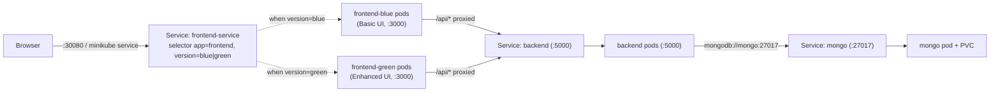

# Blue-Green Deployment — Node.js Registration App

A Node.js user-registration application (Express API + MongoDB + two frontend
variants) taken from source to a **blue-green deployment on Kubernetes
(Minikube)**, via local development and Docker Compose.

| Layer | Component | What it is |
|-------|-----------|------------|
| Data | **MongoDB** | Stores registered users. One instance, shared by everything. |
| API | **backend** | Express + Mongoose. `POST /api/users`, `GET /api/users`, `GET /api/users/count`, `GET /health`. |
| UI (blue) | **frontend-blue** | "Basic" single-page registration form. Express static server. |
| UI (green) | **frontend-green** | "Enhanced" 3-step wizard with tag inputs. Express static server. |

`frontend-blue` = **blue** = *Basic* UI · `frontend-green` = **green** = *Enhanced* UI.

---

## Table of contents

1. [Architecture](#architecture)
2. [Repository layout](#repository-layout)
3. [Prerequisites](#prerequisites)
4. [Part 1 — Local deployment](#part-1--local-deployment)
5. [Part 2 — Containerization](#part-2--containerization)
6. [Part 3 — Kubernetes deployment](#part-3--kubernetes-deployment)
7. [Part 4 — Blue-green deployment](#part-4--blue-green-deployment)
8. [Blue-green strategy (design write-up)](#blue-green-strategy-design-write-up)
9. [Challenges faced and how they were solved](#challenges-faced-and-how-they-were-solved)
10. [Cleanup](#cleanup)
11. [Screenshots](#screenshots)

---

## Architecture



**Key idea:** the browser only ever talks to the frontend it loaded. Each
frontend server reverse-proxies `/api/*` to the backend Service over the cluster
network (`BACKEND_URL` env var). So only **one** Service needs to be exposed
externally, and that Service *is* the blue-green switch.

---

## Repository layout

```
.
├── backend/
│   ├── Dockerfile            # backend image
│   ├── .dockerignore
│   ├── server.js  models/  routes/
├── frontend-blue/            # Basic UI  (blue)
│   ├── Dockerfile
│   ├── .dockerignore
│   ├── server.js             # static server + /api reverse proxy
│   └── public/
├── frontend-green/           # Enhanced UI (green)
│   ├── Dockerfile
│   ├── .dockerignore
│   ├── server.js             # static server + /api reverse proxy
│   └── public/
├── docker-compose.yml        # Part 2 – whole stack in containers
├── k8s/                      # Part 3 & 4 – Kubernetes manifests
│   ├── 00-namespace.yaml
│   ├── 10-mongo.yaml         # PVC + Deployment + Service
│   ├── 20-backend.yaml       # Deployment (2 replicas) + Service + probes
│   ├── 30-frontend-blue.yaml # Deployment (2 replicas) + probes
│   ├── 40-frontend-green.yaml# Deployment (2 replicas) + probes
│   ├── 50-frontend-service.yaml  # the switchable NodePort Service
│   ├── 60-ingress.yaml       # optional hostname
│   └── switch.sh             # blue-green switch helper
└── README.md
```

### Changes made to the provided source

| File | Change | Why |
|------|--------|-----|
| `frontend-blue/public/index.html` | `fetch('http://localhost:5000/api/users')` → `fetch('/api/users')` | Absolute `localhost` only works when the API happens to sit on the user's machine. A relative path works in every environment. |
| `frontend-green/public/app.js` | same one-line change | same |
| `frontend-blue/server.js` | added an `app.use('/api', …)` reverse proxy to `BACKEND_URL` | lets the browser stay same-origin; backend never needs external exposure |
| `frontend-green/server.js` | added `express.json()` + the same `/api` proxy + bind `0.0.0.0` | green server had no body parser; needed for proxying POST bodies |

No UI markup, styling or business logic was changed.

---

## Prerequisites

Versions this was built and verified with (macOS, Apple Silicon):

| Tool | Version |
|------|---------|
| Docker | 29.6.2 |
| Docker Compose | v5.3.1 (`docker compose`) |
| Minikube | v1.38.1 (docker driver) |
| kubectl | v1.36 client / v1.35 server |
| Node.js | v24 (containers use `node:20-alpine`) |
| MongoDB | run as a container (`mongo:7`) — no host install |

---

## Part 1 — Local deployment

Runs the three Node services directly on the host, with MongoDB in a throwaway
Docker container.

### 1. MongoDB

```bash
docker run -d --name bg-mongo -p 27017:27017 -v bg-mongo-data:/data/db mongo:7
```

### 2. Environment files

`backend/.env`
```
PORT=5001
MONGO_URI=mongodb://localhost:27017/registration
```
`frontend-blue/.env`
```
PORT=3100
BACKEND_URL=http://localhost:5001
```
`frontend-green/.env`
```
PORT=3200
BACKEND_URL=http://localhost:5001
```

> **Why 5001 and not 5000?** On macOS, port 5000 is held by the *AirPlay
> Receiver* (Control Center). The backend uses **5001 locally**; inside
> containers and Kubernetes it stays on the conventional **5000**.

### 3. Install dependencies & start (run each from its own folder — `dotenv` reads `.env` from the working directory)

```bash
(cd backend        && npm install && npm start)   # :5001
(cd frontend-blue  && npm install && npm start)   # :3100
(cd frontend-green && npm install && npm start)   # :3200
```

### 4. Verify

```bash
curl -s http://localhost:5001/health          # {"status":"ok",...}
curl -s http://localhost:3100/health          # {"version":"basic",...}
curl -s http://localhost:3200/health          # {"version":"green",...}

# register through the Basic UI's proxy
curl -s -X POST http://localhost:3100/api/users -H 'Content-Type: application/json' -d '{
  "name":"Ada","surname":"Lovelace","dob":"1815-12-10","job":"Mathematician","place":"London",
  "interests":["mathematics"],"knownLanguages":["English"],"registeredFrom":"basic"}'

curl -s http://localhost:5001/api/users/count # {"total":..,"basicUI":..,"enhancedUI":..}
docker exec bg-mongo mongosh registration --quiet --eval 'db.users.find().pretty()'
```

Open **http://localhost:3100** (Basic) and **http://localhost:3200** (Enhanced)
in a browser and submit each form — both show *"Registration successful!"* and
the records land in MongoDB.

Tear down before Part 2 (frees the ports):

```bash
# stop the 3 node processes, then:
docker rm -f bg-mongo
```
### Services running + health checks


### Blue (Basic UI) registration form


### Blue registration success


### Green (Enhanced UI) multi-step form


### Data stored in MongoDB


---

## Part 2 — Containerization

### Images

Each service has a small `Dockerfile` (`node:20-alpine`, `npm ci --omit=dev`,
non-root `node` user, `tini` as PID 1 for clean shutdown, a `HEALTHCHECK` hitting
`/health`). `.dockerignore` keeps `node_modules` and `.env` out of the image so
runtime config comes only from environment variables.

### docker-compose.yml

One command brings up MongoDB + backend + both frontends on a private network:

```bash
docker compose up --build -d
docker compose ps          # all 4 services "Up (healthy)"
```

| Service | Host port | Container port | Notes |
|---------|-----------|----------------|-------|
| mongo | 27017 | 27017 | named volume `mongo-data` |
| backend | **5001** | 5000 | `MONGO_URI=mongodb://mongo:27017/registration` |
| frontend-blue | 3100 | 3000 | `BACKEND_URL=http://backend:5000` |
| frontend-green | 3200 | 3000 | `BACKEND_URL=http://backend:5000` |

Inside Compose the frontends reach the backend by its **service name**
(`backend`), not `localhost`. Both frontends listen on **3000** in the container
(so a single Kubernetes Service `targetPort` fits both colours later).

### Verify

```bash
curl -s http://localhost:3100/health
curl -s -X POST http://localhost:3200/api/users -H 'Content-Type: application/json' -d '{
  "name":"Barbara","surname":"Liskov","dob":"1939-11-07","job":"Computer Scientist","place":"California",
  "interests":["data abstraction"],"knownLanguages":["English"],"registeredFrom":"enhanced"}'
curl -s http://localhost:5001/api/users/count
docker exec bg-mongo mongosh registration --quiet --eval 'db.users.countDocuments()'
```

Tear down before Part 3:

```bash
docker compose down          # add -v to also wipe the mongo volume
```

### Images built


### Containers running


### Blue frontend from container


### Green frontend from container


### Data persisted in the Mongo container


### Logs proving inter-container calls


---

## Part 3 — Kubernetes deployment

### One-time cluster setup

```bash
minikube start --driver=docker
minikube addons enable metrics-server
minikube addons enable ingress

# make the locally-built images available to the cluster (no registry / push)
minikube image load bluegreen/backend:v1
minikube image load bluegreen/frontend-blue:v1
minikube image load bluegreen/frontend-green:v1
minikube image load mongo:7
```

> All Deployments use `imagePullPolicy: IfNotPresent`, so the cluster uses the
> pre-loaded images instead of trying to pull from a registry.

### Deploy

```bash
kubectl apply -f k8s/
kubectl config set-context --current --namespace=blue-green   # convenience

kubectl -n blue-green rollout status deploy/mongo
kubectl -n blue-green rollout status deploy/backend
kubectl -n blue-green rollout status deploy/frontend-blue
kubectl -n blue-green rollout status deploy/frontend-green
```

### What gets created (all in namespace `blue-green`)

| Manifest | Resources |
|----------|-----------|
| `00-namespace.yaml` | Namespace `blue-green` |
| `10-mongo.yaml` | `PersistentVolumeClaim` (1Gi, RWO) · `Deployment` (1 replica, `strategy: Recreate`) · `Service` `mongo` (ClusterIP :27017) · exec ping probes |
| `20-backend.yaml` | `Deployment` `backend` (2 replicas, RollingUpdate) · `Service` `backend` (ClusterIP :5000) · HTTP `/health` liveness + readiness probes |
| `30-frontend-blue.yaml` | `Deployment` `frontend-blue` (2 replicas) — pods labelled `app=frontend, version=blue` · HTTP `/health` probes |
| `40-frontend-green.yaml` | `Deployment` `frontend-green` (2 replicas) — pods labelled `app=frontend, version=green` · HTTP `/health` probes |
| `50-frontend-service.yaml` | `Service` `frontend-service` (**NodePort 30080**) — selector `app=frontend, version=blue` |
| `60-ingress.yaml` | `Ingress` `frontend-ingress` for host `blue-green.local` (optional) |

### Health checks / readiness probes

Every application pod has both probes on its `/health` endpoint:

```yaml
readinessProbe:            # gate traffic until the app answers
  httpGet: { path: /health, port: http }
  initialDelaySeconds: 5
  periodSeconds: 10
livenessProbe:             # restart a wedged container
  httpGet: { path: /health, port: http }
  initialDelaySeconds: 15
  periodSeconds: 15
```

MongoDB uses an `exec` probe: `mongosh --eval "db.runCommand({ ping: 1 }).ok"`.

### Verify in the cluster

```bash
kubectl get all -n blue-green
kubectl get pvc,ingress -n blue-green
kubectl -n blue-green describe pod -l app=backend | grep -E 'Liveness|Readiness'

# functional test
minikube service frontend-service -n blue-green --url     # -> http://127.0.0.1:PORT
# open that URL, register a user, then:
kubectl -n blue-green exec deploy/mongo -- mongosh registration --quiet \
  --eval 'db.users.find({}, {name:1, surname:1, registeredFrom:1, _id:0}).forEach(d=>printjson(d))'
```

Result: 7 pods `Running`, all probes passing, registrations from the cluster
persisted in the PVC-backed MongoDB.

### Cluster state


### Health checks / readiness probes configured


### App working in the cluster (browser)


### Data persisted in the Mongo pod (with PVC)


---

## Part 4 — Blue-green deployment

### The two deployments and the one Service

* `frontend-blue` and `frontend-green` are **both always running** (2 replicas
  each). Their pods share the label `app: frontend` and differ by
  `version: blue` / `version: green`.
* `frontend-service` is the single stable entrypoint. Its **name, ClusterIP and
  NodePort never change**. Which colour it routes to is decided entirely by the
  `version` key in its selector.

```yaml
# k8s/50-frontend-service.yaml
spec:
  selector:
    app: frontend
    version: blue        # <-- the live colour. Patch this to switch.
```

### Switch commands

```bash
# --- switch live traffic to GREEN (Enhanced) ---
kubectl -n blue-green patch service frontend-service \
  -p '{"spec":{"selector":{"app":"frontend","version":"green"}}}'

# --- roll back to BLUE (Basic) ---
kubectl -n blue-green patch service frontend-service \
  -p '{"spec":{"selector":{"app":"frontend","version":"blue"}}}'

# --- check which colour is live ---
kubectl -n blue-green get svc frontend-service -o jsonpath='{.spec.selector}'; echo
kubectl -n blue-green get endpoints frontend-service
```

Helper script that does the patch + prints the resulting state:

```bash
./k8s/switch.sh green     # cut over to green
./k8s/switch.sh blue      # roll back to blue
./k8s/switch.sh status    # show live colour, selector, endpoints, /health
```

### Demonstrated switch (actual run)

```
STEP 1  BEFORE            selector version=blue
        endpoints         10.244.0.157 10.244.0.158      (the frontend-blue pods)
        GET /health       {"message":"Basic frontend is running","version":"basic"}

STEP 2  kubectl patch ... version=green      ->  service/frontend-service patched

STEP 3  AFTER             selector version=green
        endpoints         10.244.0.159 10.244.0.160      (the frontend-green pods)
        GET /health       {"message":"Green frontend is running","version":"green"}
        (same Service, same URL — now serving the Enhanced UI)

STEP 4  registered "Evelyn Boyd" (registeredFrom=enhanced) through the green service — 201 Created

STEP 5  kubectl patch ... version=blue       ->  rollback
        endpoints         10.244.0.157 10.244.0.158  again
        GET /health       {"version":"basic"}

STEP 6  mongosh: count=2  -> Dorothy Vaughan (basic, added on blue) AND
                             Evelyn Boyd    (enhanced, added on green)
        => no data lost across switch or rollback
```

To watch it in the browser: keep `minikube service frontend-service -n
blue-green --url` running in one terminal, run the `kubectl patch` in another,
then refresh the browser — the Basic form becomes the Enhanced wizard at the
same address, and back again on rollback.

---

## Blue-green strategy (design write-up)

**Goal.** Cut all users from one frontend version to another instantly, with an
instant rollback path and zero data loss.

**Mechanism — Service selector swap.**
Kubernetes builds a Service's endpoint list by matching its `selector` against
pod labels. Both colours are deployed and *Ready* at all times; the Service
selector pins `version: <blue|green>` so exactly one colour receives traffic.
Patching that one label rewrites the endpoint list in place — no pod is created,
restarted or pulled, so the cutover is effectively atomic and sub-second. It is a
pure control-plane change.

**Why the cutover is safe.**
* The idle colour keeps running at full replica count, so rollback is the same
  one-line patch in reverse — no rebuild, no wait.
* `backend` and `mongo` live **outside** the switch as shared singletons. The
  blue and green frontends are just static UIs talking to the identical API, so
  there is no database migration and nothing to lose when the selector moves.
  This was verified: a record added while blue was live and a record added while
  green was live were both present after rolling back to blue.
* Readiness probes mean a colour can only be a Service endpoint once its pods
  actually answer `/health`, so a broken new version never receives traffic.

**Typical promotion flow (blue live, promoting green):**
1. Update/redeploy `frontend-green` (new image). Old green pods roll, new ones
   must pass readiness.
2. Smoke-test green in isolation — `kubectl port-forward deploy/frontend-green`
   or a temporary `version: green` Service — without touching live traffic.
3. `kubectl patch` the `frontend-service` selector to `version: green`. All users
   are now on green.
4. Watch logs / health. If anything is wrong, `kubectl patch` back to `blue` —
   instant rollback.
5. Once green is trusted, blue is free to be updated to the next version and
   becomes the new idle/rollback target.

**Trade-offs.** Both colours run simultaneously, so the frontend tier costs ~2×
resources. The shared database means the two versions must stay
schema-compatible (they are — same API contract). For a stateful app you would
add expand/contract migrations so both versions can read the DB during the
window.

**Alternatives considered.** Two Deployments behind one Ingress with weighted
`canary` annotations (gradual %-based shift) or a service mesh (Istio
`VirtualService` weights). The selector swap was chosen for this assignment
because it is the simplest thing that is genuinely atomic, needs no extra
components, and has a trivial rollback.

---

## Challenges faced and how they were solved

| # | Challenge | Root cause | Fix |
|---|-----------|-----------|-----|
| 1 | Backend crashed on start locally: `EADDRINUSE :5000` | macOS **AirPlay Receiver** (Control Center) permanently listens on `*:5000` | Backend runs on **5001 locally**; kept on 5000 inside containers/K8s where there is no conflict. Documented in every local `.env`. |
| 2 | Frontends worked locally but would break in Docker/K8s | The form did `fetch('http://localhost:5000/...')` — that runs in the **browser**, where `localhost` is the user's machine, not a cluster Service | Changed to relative `fetch('/api/users')` and added a small `/api` **reverse proxy** in each frontend `server.js` that forwards to `BACKEND_URL`. Browser stays same-origin; backend needs no external exposure. |
| 3 | `PORT` from `.env` was ignored; services took default ports | `require('dotenv').config()` reads `.env` from the **current working directory**, and services were launched from the repo root | Launch each service from its own directory (`cd backend && npm start`). Documented. |
| 4 | `git add` skipped the Dockerfiles | Provided `.gitignore` contained `Dockerfile` and `package-lock.json` | Rewrote `.gitignore` — those are deliverables, and `package-lock.json` is needed for reproducible `npm ci` in the image build. |
| 5 | One Service must front two frontends that listened on different ports (3100 vs 3200) | A Service has a single `targetPort` | Standardised **both** frontend containers to listen on **3000** via the `PORT` env; the Service `targetPort` is the named port `http` (3000) for either colour. |
| 6 | `green` frontend couldn't proxy POST bodies | `frontend-green/server.js` had no `express.json()` body parser | Added `express.json()` + `express.urlencoded()` before the proxy. |
| 7 | Verifying the switch with `kubectl port-forward svc/frontend-service` didn't reflect the patch | `port-forward` to a Service binds to **one pod chosen at start** and stays there | Verified via `minikube service` (re-proxies through the NodePort, which re-resolves endpoints) and via in-cluster `wget http://frontend-service/health` from a backend pod. |
| 8 | Cluster shouldn't depend on Docker Hub | Local-only assignment, images built locally | `minikube image load <image>` for all four images + `imagePullPolicy: IfNotPresent`. No registry, no push, no credentials. |
| 9 | Mongo pod could deadlock on redeploy | A `ReadWriteOnce` PVC can't be mounted by an old and new pod at once during a rolling update | `strategy: type: Recreate` on the `mongo` Deployment. |

### Before (blue live) - Terminal - B


### The patch (Terminal B)


### Rollback


---

